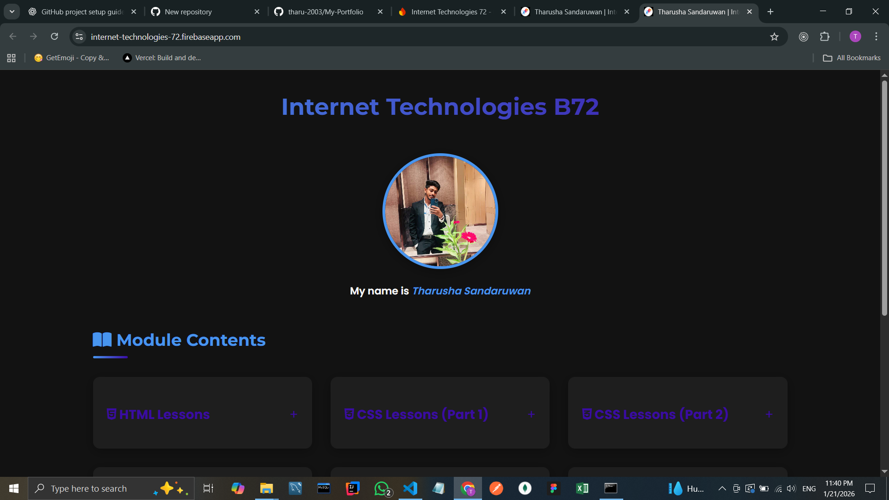
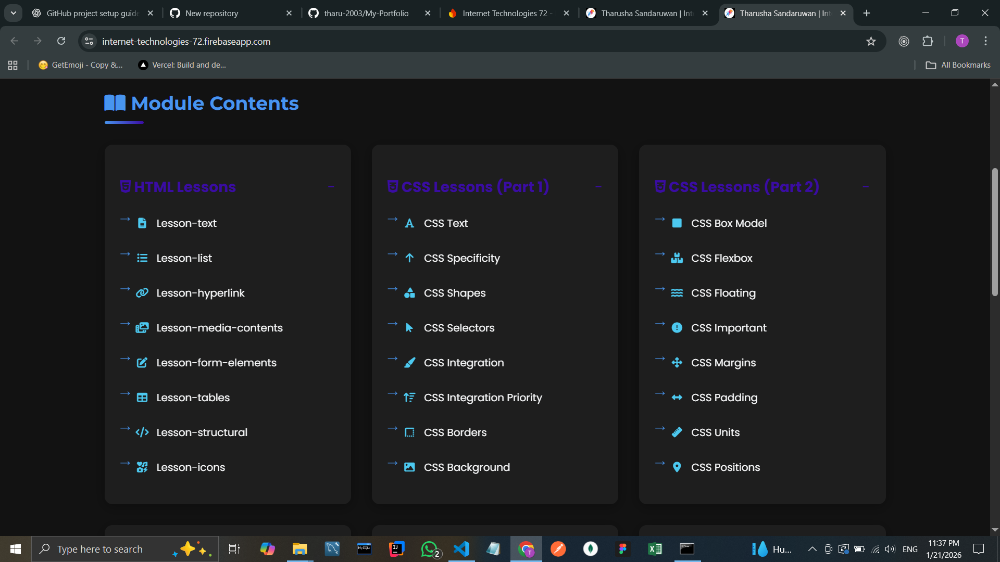
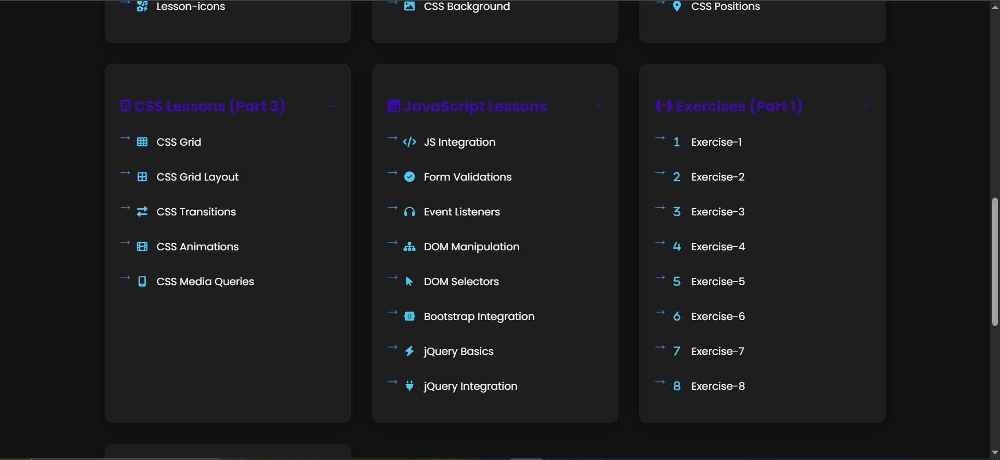

# 🌐 Internet Technologies Module Website

## 📘 Project Overview

This project is a **learning-based website** developed to practice and demonstrate the concepts taught in the **Internet Technologies module**.  
It contains structured lessons, CSS demonstrations, JavaScript basics, and practical exercises, all organized in a clean and modern UI.

The website is designed for **self-learning**, **revision**, and **academic demonstrations**.

---

## 🚀 Live Demo

🔗 **Live Website**:  
https://internet-technologies-72.firebaseapp.com

---

## 🖼️ Project UI

Below are some previews of the Internet Technologies learning website:

### 📌 Module Contents View

### 🎨 CSS Lessons Section

### ⚙️ JavaScript & Exercises Section

---

## 🧠 Module Contents

### 📄 HTML Lessons
- Text elements
- Lists
- Hyperlinks
- Media contents
- Form elements
- Tables
- Structural elements
- Icons

---

### 🎨 CSS Lessons (Part 1)
- CSS Text
- CSS Specificity
- CSS Shapes
- CSS Selectors
- CSS Integration
- CSS Integration Priority
- CSS Borders
- CSS Background

---

### 🎨 CSS Lessons (Part 2)
- CSS Box Model
- CSS Flexbox
- CSS Floating
- CSS !important
- CSS Margins
- CSS Padding
- CSS Units
- CSS Positions

---

### 🎨 CSS Lessons (Part 3)
- CSS Grid
- CSS Grid Layout
- CSS Transitions
- CSS Animations
- CSS Media Queries

---

### ⚙️ JavaScript Lessons
- JavaScript Integration
- Form Validations
- Event Listeners
- DOM Manipulation
- DOM Selectors
- Bootstrap Integration
- jQuery Basics
- jQuery Integration

---

### 📝 Exercises
- Exercise 01 – Exercise 08  
(Hands-on practical tasks to reinforce learning)

---

## 🛠️ Technologies Used

- **HTML5**
- **CSS3**
- **JavaScript**
- **Bootstrap**
- **jQuery**
- **Firebase Hosting**

---

## 🎯 Project Objectives

- Understand core **web development concepts**
- Practice **HTML, CSS, and JavaScript**
- Learn responsive design using **CSS Grid & Flexbox**
- Improve DOM manipulation skills
- Prepare for academic and practical evaluations

---

## 📂 Project Structure (Simplified)

📁 project-root
┣ 📁 html-lessons
┣ 📁 css-lessons
┣ 📁 javascript-lessons
┣ 📁 exercises
┣ 📁 assets
┣ 📄 index.html
┣ 📄 style.css
┗ 📄 script.js

---

## 👨‍🎓 Author

**Tharusha Sandaruwan**  
📚 Internet Technologies Module  
🎓 IJSE / Academic Project

---

## 📜 License

This project is created **for educational purposes only**.  
Feel free to use it for learning and practice.

---

✨ *Happy Coding!* ✨
